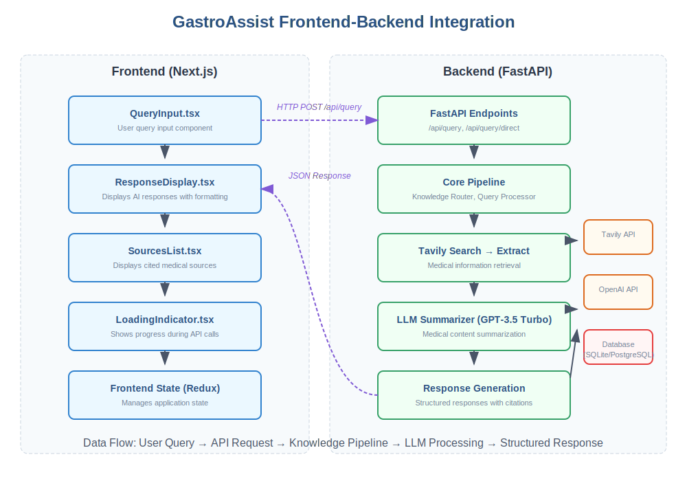

# System Architecture Overview

## High-Level Architecture

## System Components

1. **Frontend**: Multi-platform interface providing seamless access for gastroenterologists through web and mobile applications, with a secure API gateway for integration with hospital systems.

2. **Core System**: Intelligent processing pipeline that analyzes clinical queries, determines information needs, and routes to appropriate knowledge sources using domain-specific reasoning.
   - **Query Processor**: Normalizes and preprocesses query text
   - **Reasoning Agent**: Analyzes the query with medical terminology recognition
   - **Knowledge Router**: Orchestrates the enhanced pipeline flow

3. **Knowledge Pipeline**: Enhanced multi-stage pipeline for accurate information retrieval and summarization:
   - **Tavily Search**: Specialized medical search for finding relevant content
   - **Tavily Extract**: Content extraction using Tavily Search API with raw content
   - **LLM Summarizer**: GPT-3.5 Turbo with medical prompting for concise responses

4. **Response Generation**: Synthesizes information into concise, clinically relevant answers with comprehensive source attribution and quality verification.
   - **Source Compilation**: Attaches reference information for traceability
   - **Quality Assurance**: Verifies medical accuracy and completeness

## Data Flow

1. User submits a gastroenterology-related query through the interface
2. Query Processor analyzes intent and extracts clinical concepts
3. Reasoning Agent identifies medical terminology and determines information needs
4. Knowledge Router initiates the enhanced pipeline:
   - Tavily Search finds relevant medical content
   - Tavily Extract retrieves full content from top results
   - LLM Summarizer generates concise medical responses
5. Quality Assurance verifies the response and adds confidence score
6. Response is delivered to user with proper source attribution

## Integration Architecture

The frontend and backend integrate through a RESTful API:

- **Frontend Components** (Next.js/React):
  - QueryInput.tsx: User query interface
  - ResponseDisplay.tsx: Renders AI responses
  - SourcesList.tsx: Displays medical sources
  - Redux Store: Manages application state

- **Backend Components** (FastAPI):
  - API Endpoints: Process incoming queries
  - Core Pipeline: Routes queries through the system
  - Enhanced Pipeline: Tavily Search → Extract → LLM Summarizer
  - Response Generation: Creates structured responses

## Error Handling Strategy

The system implements multi-tiered error handling at various levels:

1. **Search-Level Fallbacks**:
   - API authentication failures
   - Automatic retries for transient errors
   - Fallback search results

2. **Extraction-Level Fallbacks**:
   - Primary: Tavily API with raw content
   - Secondary: Direct HTML extraction
   - Tertiary: Basic URL information

3. **Summarization-Level Fallbacks**:
   - Content validation before processing
   - Null-safety checks throughout
   - Default responses for edge cases

## Security Considerations

- HIPAA-compliant data handling and storage
- End-to-end encryption for all communications
- Role-based access control for different user types
- Audit logging of all system interactions
- Regular security assessments and penetration testing

## Scalability

- Containerized microservices architecture for independent scaling
- Distributed knowledge base with caching for high-performance retrieval
- Asynchronous processing for handling concurrent queries
- Cloud-native deployment with auto-scaling capabilities
- Performance monitoring and optimization feedback loop
