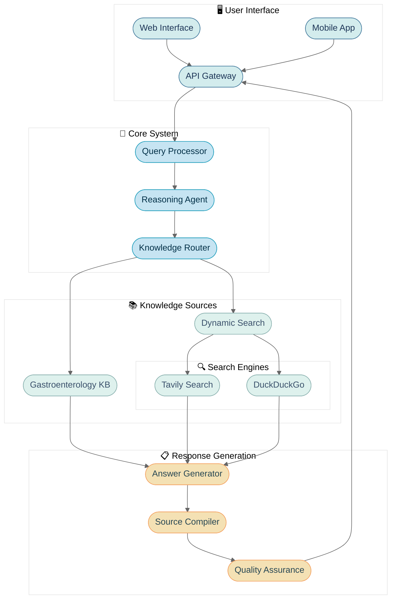

# System Architecture Overview

## High-Level Architecture

## Components
1. **Frontend**: Multi-platform interface providing seamless access for gastroenterologists through web and mobile applications, with a secure API gateway for integration with hospital systems.

2. **Core System**: Intelligent processing pipeline that analyzes clinical queries, determines information needs, and routes to appropriate knowledge sources using domain-specific reasoning.

3. **Knowledge Sources**: Dual-source information retrieval combining:
   - Curated Gastroenterology Knowledge Base: Validated clinical guidelines, research papers, and treatment protocols
   - Dynamic Search: Real-time information retrieval from medical search engines for latest research and case studies

4. **Response Generation**: Synthesizes information into concise, clinically relevant answers with comprehensive source attribution and quality verification.

## Data Flow
1. User submits a gastroenterology-related query through the interface
2. Query Processor analyzes intent and extracts clinical concepts
3. Reasoning Agent determines required information sources and query strategy
4. Knowledge Router retrieves information from static KB and/or dynamic search
5. Answer Generator synthesizes a concise, contextually relevant response
6. Source Compiler attaches all reference information for traceability
7. Quality Assurance verifies medical accuracy and completeness
8. Response is delivered to user with source attribution

## Security Considerations
- HIPAA-compliant data handling and storage
- End-to-end encryption for all communications
- Role-based access control for different user types
- Audit logging of all system interactions
- Regular security assessments and penetration testing

## Scalability
- Containerized microservices architecture for independent scaling
- Distributed knowledge base with caching for high-performance retrieval
- Asynchronous processing for handling concurrent queries
- Cloud-native deployment with auto-scaling capabilities
- Performance monitoring and optimization feedback loop